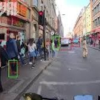
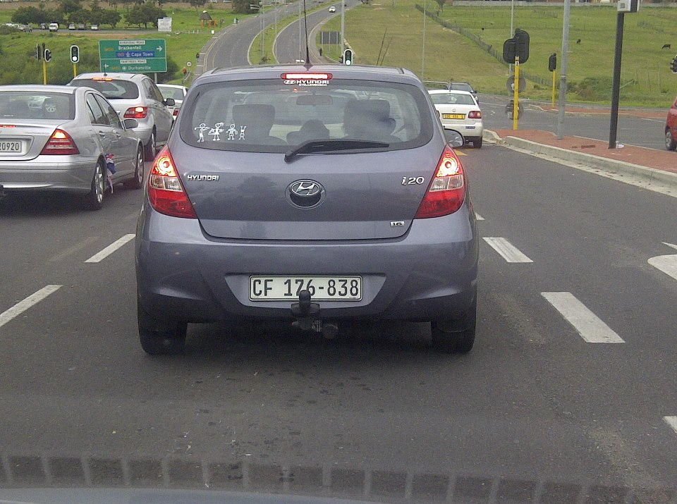
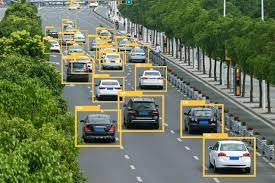

  
  
  
  

I love the idea of smart cities. The thought of automated smart energy systems, electrical grids, one-touch access ports – it’s an enthralling concept! Honestly, it’s a dream for a data scientist and I’m delighted that a lot of cities around the world are moving towards becoming smarter.

One of the core components of a smart city is automated traffic management. And that got me thinking – could I use my data science chops to build a vehicle detection model that could play a part in smart traffic management?

Think about it – if you could integrate a vehicle detection system in a traffic light camera, you could easily track a number of useful things simultaneously:

  How many vehicles are present at the traffic junction during the day?
  What time does the traffic build up?
  What kind of vehicles are traversing the junction (heavy vehicles, cars, etc.)?
  Is there a way to optimize the traffic and distribute it through a different street?
  And so on. The applications are endless!

Us humans can easily detect and recognize objects from complex scenes in a flash. Translating that thought process to a machine, however, requires us to learn the art of object detection using computer vision algorithms.

Source: <a href="https://github.com/i-akshat-jain/AI-Car---Pedestrian-Tracking"><i class="large github icon"></i>AI-Car-&-Pedestrian-Detection</a>

