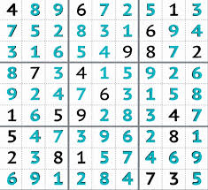

Sudoku is one of the most popular puzzle of all time.The goal of Sudoku is to fill 9x9 grid such that each row,each column and 3x3 grid contains all of the digits between 1 to 9. In this project we aim to create a real time Sudoku solver which recognise the elements of Sudoku puzzle and providing a digital solution using Computer vision.
 
Sudoku Solver AR is an augmented reality Sudoku solver. It captures video using a camera, finds Sudoku puzzles in the video, and then displays answers to those puzzles in such a way that they look like they are part of the original scene.

Source: <a href="https://github.com/i-akshat-jain/AI-Car---Pedestrian-Tracking"><i class="large github icon"></i>theVacay/vacay</a>
